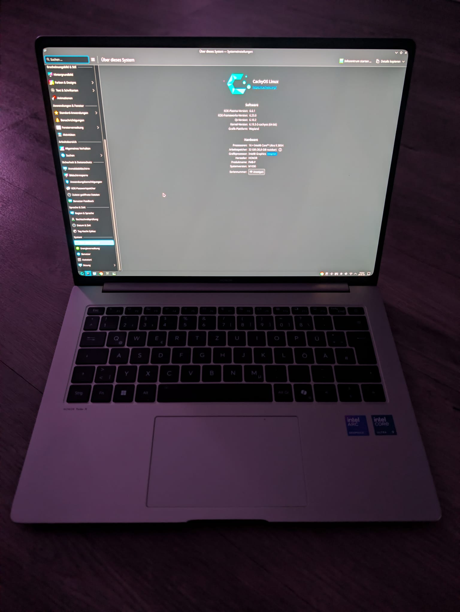

# honor-magicbook-14-pro-2025-cachyos-workaround
Install CachyOs(Kernel 6.19) on Honor MagicBook Pro 14 with denis-bb fix.

# Honor MagicBook Pro 14 (2025)

## CachyOS (Kernel 6.19) + Limine Bootloader Workaround

This guide fixes the following issues on the Honor MagicBook Pro 14
(2025) when running CachyOS (Kernel 6.19):

-   Touchpad not working
-   FN keys not working
-   Missing power/energy options
-   Broken thermal/fan control
-   ACPI I2C errors in dmesg

After applying this workaround:

-   Touchpad works
-   FN keys mostly functional
-   Energy options restored
-   Thermal/fan control restored

------------------------------------------------------------------------

## Important Notes

-   During Live USB installation, the internal keyboard and touchpad do
    NOT work.
-   You need an external USB keyboard and mouse for installation.
-   After installation, the internal keyboard works (without FN keys).

------------------------------------------------------------------------

## 1. Download the DSDT Patch

Use of the DSDT patch is at your own risk. You can also create these yourself!

Repository: https://github.com/denis-bb/honor-fmb-p-dsdt/

Download:

-   dsdt-global.aml (Global version) OR
-   dsdt-chinese.aml (Chinese version)

------------------------------------------------------------------------

## 2. Rename the File

Must be renamed exactly:

    mv dsdt-global.aml DSDT.aml

Uppercase is required: DSDT.aml

------------------------------------------------------------------------

## 3. Create Early ACPI Override Structure

    mkdir -p ~/acpi_override/kernel/firmware/acpi
    cp DSDT.aml ~/acpi_override/kernel/firmware/acpi/

------------------------------------------------------------------------

## 4. Create Early Initrd Archive

Install cpio if needed:

    sudo pacman -S cpio

Create archive:

    cd ~/acpi_override
    find . | cpio -H newc --create > acpi_override.cpio
    sudo cp acpi_override.cpio /boot/

------------------------------------------------------------------------

## 5. Also Add DSDT to Regular Initramfs

    sudo mkdir -p /usr/lib/firmware/acpi
    sudo cp ~/acpi_override/kernel/firmware/acpi/DSDT.aml /usr/lib/firmware/acpi/

------------------------------------------------------------------------

## 6. Configure mkinitcpio

Edit:

    sudo nano /etc/mkinitcpio.conf

Change:

    FILES=()

To:

    FILES=(/usr/lib/firmware/acpi/DSDT.aml)

Rebuild initramfs:

    sudo mkinitcpio -P

------------------------------------------------------------------------

## 7. Configure Limine (CRITICAL STEP)

Edit:

    sudo nano /boot/limine.conf

Inside your /+CachyOS kernel block:

### ~~A) Correct module order~~

~~acpi_override.cpio MUST be above the normal initramfs:
    module_path: boot():/acpi_override.cpio
    module_path: boot():/......../linux-cachyos/initramfs-linux-cachyos#HASH
Order is critical.~~

### ~~B) Add Kernel Parameter~~

~~In the cmdline: line, add:
    acpi_override=1
Example:
    cmdline: quiet nowatchdog splash rw rootflags=subvol=/@ root=UUID=XXXX acpi_override=1~~

**(Update 01.03.26)**
Insert the following lines directly after 
/CachyOS-ACPI-FIX
with your own root ID. Check the entries below that begin with “root=UUID=”:

    /CachyOS-ACPI-FIX
      protocol: linux
      path: boot():/cachy-kernel/vmlinuz-linux-cachyos
      module_path: boot():/acpi_override.cpio
      module_path: boot():/cachy-kernel/initramfs-linux-cachyos
      cmdline: quiet nowatchdog splash rw rootflags=subvol=/@ root=UUID=YOUR_UUID acpi_override=1

You can also set default_entry: at the top of the file to 1 so that the default is booted.

------------------------------------------------------------------------

## 8. Reboot

Restart the system.

------------------------------------------------------------------------

## 9. Verify Override

After boot:

    sudo dmesg | grep -i "DSDT\|override"

You should see something similar to:

    ACPI: DSDT ACPI table found in initrd [kernel/firmware/acpi/DSDT.aml]
    ACPI: Table Upgrade: override [DSDT- HONOR- ARL]
    ACPI: Physical table override

If you see this --- the patch is active.

------------------------------------------------------------------------

## Result

-   Touchpad working
-   FN keys mostly working
-   Energy options restored
-   Thermal control fixed
-   I2C ACPI errors gone

------------------------------------------------------------------------

## Known Issue

Screen brightness may fluctuate slightly after applying the patch.

Workaround: Disable automatic brightness adjustment in power settings.

------------------------------------------------------------------------

## Technical Background

The BIOS of the Honor MagicBook Pro 14 (2025) contains a broken ACPI
DSDT:

-   Missing I2C controller definitions
-   Broken EC/WMI methods
-   Thermal zones fail
-   Touchpad never initializes

This workaround replaces the faulty DSDT very early during boot.

------------------------------------------------------------------------

## Tested With

-   CachyOS
-   Linux Kernel 6.19.x
-   Limine Bootloader

------------------------------------------------------------------------

## Credits

-   Denis-bb for the DSDT patch
-   Linux ACPI developers
